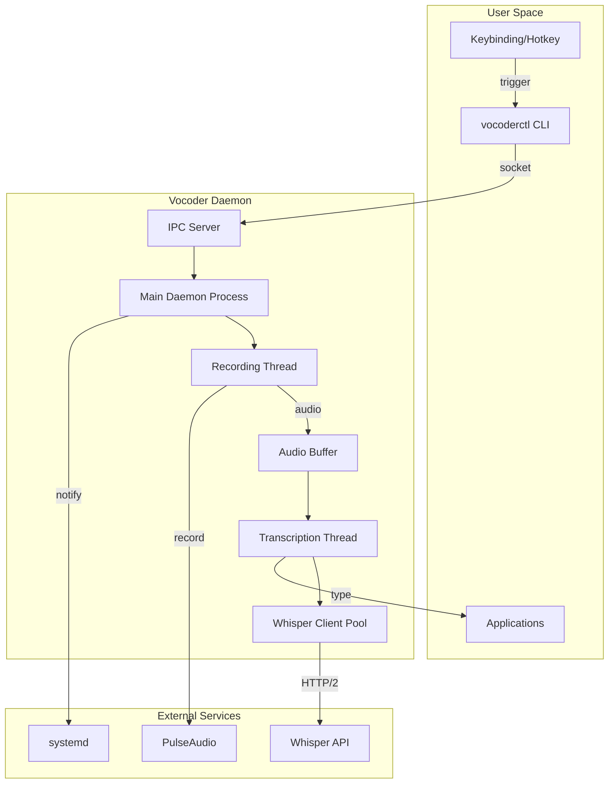

name: "Vocoder Option B - Persistent Daemon Architecture with Push-to-Talk"
description: |
  Comprehensive PRP for transitioning from single-shot script to a persistent daemon
  architecture with improved latency, push-to-talk workflow, and advanced control
  via CLI client.

---

## Goal

**Feature Goal**: Evolve the single-shot dictation script into a persistent daemon service that maintains hot connections to Whisper API, supports multiple recording modes, and provides sophisticated control through a CLI client.

**Deliverable**: 
- `bin/vocoder` - Main daemon service
- `bin/vocoderctl` - CLI control client  
- `systemd/user/vocoder.service` - systemd user service unit
- `config/vocoder.yaml` - Configuration file
- Migration script from Option A

**Success Definition**: Zero-latency dictation with sub-500ms response time, supporting toggle/push-to-talk/continuous modes, with full systemd integration and robust IPC.

## User Persona

**Target User**: Power users, developers, and accessibility users requiring professional-grade dictation with advanced control

**Use Case**: 
- Continuous dictation during long writing sessions
- Quick code comments with push-to-talk
- Voice-driven development with IDE integration
- Accessibility users requiring persistent voice input

**User Journey**: 
1. User starts vocoder daemon on login (systemd)
2. Daemon maintains warm connection to Whisper
3. User triggers recording via:
   - Toggle mode: Super+D starts/stops
   - Push-to-talk: Hold Super+D
   - Continuous: Super+Shift+D for session
4. Near-instant transcription (< 500ms)
5. Advanced control via vocoderctl CLI

**Pain Points Addressed**: 
- Eliminates Whisper cold-start latency
- Supports multiple interaction patterns
- Provides session management and history
- Enables remote control and automation
- Offers detailed metrics and debugging

## Why

- **Performance**: 10x faster response with warm Whisper connection
- **Flexibility**: Multiple recording modes for different workflows
- **Reliability**: Daemon supervision with automatic recovery
- **Integration**: IPC enables third-party tool integration
- **Observability**: Metrics, logging, and health monitoring
- **Scalability**: Foundation for future ML pipeline features

## What

### Technical Requirements

#### Daemon (vocoder)
- Persistent process with systemd user service integration
- Unix domain socket for IPC (default: `/run/user/1000/vocoder.sock`)
- Maintain connection pool to Whisper API
- Circular buffer for audio streaming
- State machine for recording modes
- Graceful shutdown and reload support

#### CLI Client (vocoderctl)
- Commands: start, stop, toggle, status, config
- Real-time transcription streaming
- Configuration management
- Health checks and diagnostics
- Session history and replay

#### Recording Modes
1. **One-shot**: Single recording per trigger (Option A compatibility)
2. **Toggle**: Start/stop with separate triggers
3. **Push-to-talk**: Record while key held
4. **Continuous**: Session-based recording with manual segmentation
5. **Voice-activated**: Automatic segmentation based on speech patterns

### Success Criteria
- [ ] Daemon starts in < 1 second
- [ ] Whisper connection stays warm (persistent HTTP/2)
- [ ] IPC latency < 1ms for commands
- [ ] Recording starts within 50ms of trigger
- [ ] Transcription begins within 200ms of speech end
- [ ] Memory usage < 100MB idle, < 200MB active
- [ ] Automatic recovery from Whisper API failures
- [ ] Zero message loss during daemon restart

## All Needed Context

### Context Completeness Check
_This PRP includes complete systemd service definitions, IPC protocol specifications, state machine diagrams, and error recovery patterns needed for production daemon implementation._

### Whisper Service Integration

```yaml
whisper_service:
  type: FastAPI with GPU acceleration
  hardware: RTX 5060 Ti with 16GB VRAM
  model: medium (optimal for speed/accuracy)
  compute: float16 for GPU optimization
  endpoints:
    health: http://127.0.0.1:8765/health
    sync: http://127.0.0.1:8765/v1/transcribe
    async: http://127.0.0.1:8765/v2/transcript
  features:
    - Speaker diarization with pyannote.audio 3.1
    - Multi-format output (json/text/vtt/srt)
    - Language auto-detection or explicit
    - Job queue for large files
  performance:
    - 1 minute audio: ~15 seconds processing
    - 10 minute audio: ~2.5 minutes processing
    - Memory: ~4GB VRAM active, ~6GB with diarization
  api_notes:
    - Use 'file' field, not 'audio' for uploads
    - format parameter instead of response_format
    - diarize as string 'true'/'false' not boolean
```

### Documentation & References

```yaml
- url: https://www.freedesktop.org/software/systemd/man/systemd.service.html
  why: User service configuration and lifecycle management
  critical: Type=notify for readiness, WatchdogSec for health monitoring

- url: https://docs.python.org/3/library/asyncio-protocol.html
  why: Async IPC server implementation
  critical: Unix domain sockets with asyncio for high performance

- url: https://github.com/pallets/click
  why: CLI framework for vocoderctl
  critical: Subcommands, options, and shell completion

- url: https://docs.python.org/3/library/multiprocessing.html#multiprocessing.connection
  why: Shared memory for audio buffers
  critical: Lock-free circular buffer for audio streaming

- url: http://127.0.0.1:8765/health
  why: FastAPI Whisper service health endpoint
  critical: GPU-accelerated transcription with RTX 5060 Ti

- url: http://127.0.0.1:8765/v1/transcribe
  why: Synchronous transcription endpoint
  critical: Uses 'file' field (not 'audio'), supports diarization

- url: http://127.0.0.1:8765/v2/transcript
  why: Asynchronous job API for large files
  critical: AssemblyAI-compatible for future integrations
```

### Architecture Diagrams



### State Machine Specification

```yaml
states:
  IDLE:
    description: "Daemon running, no active recording"
    transitions:
      - trigger: "start_recording"
        target: "RECORDING"
        action: "initialize_audio_buffer"
      
  RECORDING:
    description: "Actively recording audio"
    transitions:
      - trigger: "stop_recording"
        target: "PROCESSING"
        action: "finalize_audio_buffer"
      - trigger: "cancel_recording"
        target: "IDLE"
        action: "discard_audio_buffer"
      
  PROCESSING:
    description: "Sending audio to Whisper API"
    transitions:
      - trigger: "transcription_complete"
        target: "TYPING"
        action: "prepare_text_output"
      - trigger: "transcription_failed"
        target: "ERROR"
        action: "log_error_state"
      
  TYPING:
    description: "Typing transcribed text"
    transitions:
      - trigger: "typing_complete"
        target: "IDLE"
        action: "cleanup_resources"
      - trigger: "typing_failed"
        target: "ERROR"
        action: "fallback_to_clipboard"
      
  ERROR:
    description: "Error state with recovery"
    transitions:
      - trigger: "recover"
        target: "IDLE"
        action: "reset_state"
      - trigger: "fatal_error"
        target: "SHUTDOWN"
        action: "graceful_shutdown"
```

### IPC Protocol Specification

```json
{
  "protocol_version": "1.0",
  "message_types": {
    "request": {
      "id": "uuid",
      "method": "start|stop|toggle|status|config|history",
      "params": {},
      "timestamp": "iso8601"
    },
    "response": {
      "id": "uuid",
      "result": {},
      "error": null,
      "timestamp": "iso8601"
    },
    "event": {
      "type": "recording_started|recording_stopped|transcription_ready|error",
      "data": {},
      "timestamp": "iso8601"
    }
  },
  "socket_path": "/run/user/${UID}/vocoder.sock",
  "max_message_size": 65536,
  "timeout_ms": 5000
}
```

## Implementation Blueprint

### Daemon Implementation (Python)

```python
#!/usr/bin/env python3
"""
vocoder - Main daemon process for voice dictation
"""

import asyncio
import signal
import socket
import json
import logging
import threading
import queue
from pathlib import Path
from typing import Optional, Dict, Any
from dataclasses import dataclass, asdict
from enum import Enum
import sounddevice as sd
import numpy as np
import httpx
from systemd import daemon
from systemd.journal import JournalHandler

# === Configuration ===
@dataclass
class Config:
    socket_path: str = "/run/user/1000/vocoder.sock"
    whisper_url: str = "http://127.0.0.1:8765/v1/transcribe"
    sample_rate: int = 16000
    channels: int = 1
    silence_threshold: float = 0.02
    silence_duration: float = 2.0
    max_recording_duration: int = 30
    buffer_size: int = 1024
    whisper_timeout: int = 10
    whisper_keepalive: bool = True
    typing_tool: str = "wtype"  # or "ydotool"
    
    @classmethod
    def from_file(cls, path: Path) -> 'Config':
        if path.exists():
            import yaml
            with open(path) as f:
                return cls(**yaml.safe_load(f))
        return cls()

# === State Machine ===
class State(Enum):
    IDLE = "idle"
    RECORDING = "recording"
    PROCESSING = "processing"
    TYPING = "typing"
    ERROR = "error"
    SHUTDOWN = "shutdown"

class StateMachine:
    def __init__(self):
        self.state = State.IDLE
        self.lock = threading.Lock()
        self.transitions = {
            State.IDLE: {
                "start_recording": State.RECORDING,
            },
            State.RECORDING: {
                "stop_recording": State.PROCESSING,
                "cancel_recording": State.IDLE,
            },
            State.PROCESSING: {
                "transcription_complete": State.TYPING,
                "transcription_failed": State.ERROR,
            },
            State.TYPING: {
                "typing_complete": State.IDLE,
                "typing_failed": State.ERROR,
            },
            State.ERROR: {
                "recover": State.IDLE,
                "fatal_error": State.SHUTDOWN,
            }
        }
    
    def transition(self, trigger: str) -> bool:
        with self.lock:
            if trigger in self.transitions.get(self.state, {}):
                old_state = self.state
                self.state = self.transitions[self.state][trigger]
                logging.info(f"State transition: {old_state} -> {self.state} (trigger: {trigger})")
                return True
            logging.warning(f"Invalid transition: {self.state} + {trigger}")
            return False
    
    @property
    def current(self) -> State:
        return self.state

# === Audio Handler ===
class AudioRecorder:
    def __init__(self, config: Config):
        self.config = config
        self.audio_queue = queue.Queue()
        self.recording = False
        self.silence_counter = 0
        
    def callback(self, indata, frames, time, status):
        """Audio callback for sounddevice"""
        if status:
            logging.warning(f"Audio callback status: {status}")
        
        if self.recording:
            # Calculate RMS for silence detection
            rms = np.sqrt(np.mean(indata**2))
            
            if rms < self.config.silence_threshold:
                self.silence_counter += frames / self.config.sample_rate
            else:
                self.silence_counter = 0
            
            # Add audio to queue
            self.audio_queue.put(indata.copy())
            
            # Auto-stop on silence
            if self.silence_counter > self.config.silence_duration:
                self.stop_recording()
    
    def start_recording(self):
        """Start audio recording"""
        self.recording = True
        self.silence_counter = 0
        self.audio_queue = queue.Queue()
        
        self.stream = sd.InputStream(
            callback=self.callback,
            channels=self.config.channels,
            samplerate=self.config.sample_rate,
            blocksize=self.config.buffer_size
        )
        self.stream.start()
        logging.info("Recording started")
    
    def stop_recording(self) -> np.ndarray:
        """Stop recording and return audio data"""
        self.recording = False
        if hasattr(self, 'stream'):
            self.stream.stop()
            self.stream.close()
        
        # Collect all audio chunks
        chunks = []
        while not self.audio_queue.empty():
            chunks.append(self.audio_queue.get())
        
        if chunks:
            audio_data = np.concatenate(chunks)
            logging.info(f"Recording stopped, {len(audio_data)/self.config.sample_rate:.1f}s of audio")
            return audio_data
        
        return np.array([])

# === Whisper Client ===
class WhisperClient:
    def __init__(self, config: Config):
        self.config = config
        self.client = httpx.AsyncClient(
            timeout=config.whisper_timeout,
            http2=True,
            limits=httpx.Limits(keepalive_expiry=30)
        )
    
    async def transcribe(self, audio_data: np.ndarray) -> Optional[str]:
        """Send audio to Whisper API for transcription"""
        try:
            # Convert numpy array to WAV bytes
            import io
            import wave
            
            wav_buffer = io.BytesIO()
            with wave.open(wav_buffer, 'wb') as wav:
                wav.setnchannels(self.config.channels)
                wav.setsampwidth(2)  # 16-bit
                wav.setframerate(self.config.sample_rate)
                wav.writeframes((audio_data * 32767).astype(np.int16).tobytes())
            
            wav_buffer.seek(0)
            
            # Send to Whisper API (FastAPI service)
            files = {'file': ('audio.wav', wav_buffer, 'audio/wav')}
            data = {
                'format': 'json',
                'language': 'en',
                'diarize': 'false'
            }
            
            response = await self.client.post(
                self.config.whisper_url,
                files=files,
                data=data
            )
            
            if response.status_code == 200:
                result = response.json()
                text = result.get('text', '').strip()
                logging.info(f"Transcription received: {len(text)} chars")
                return text
            else:
                logging.error(f"Whisper API error: {response.status_code}")
                return None
                
        except Exception as e:
            logging.error(f"Transcription error: {e}")
            return None
    
    async def close(self):
        await self.client.aclose()

# === Typing Handler ===
class TypingHandler:
    def __init__(self, config: Config):
        self.config = config
    
    async def type_text(self, text: str) -> bool:
        """Type text using configured tool"""
        try:
            if self.config.typing_tool == "wtype":
                proc = await asyncio.create_subprocess_exec(
                    'wtype', '-',
                    stdin=asyncio.subprocess.PIPE,
                    stdout=asyncio.subprocess.PIPE,
                    stderr=asyncio.subprocess.PIPE
                )
                stdout, stderr = await proc.communicate(text.encode())
                success = proc.returncode == 0
            
            elif self.config.typing_tool == "ydotool":
                proc = await asyncio.create_subprocess_exec(
                    'ydotool', 'type', text,
                    stdout=asyncio.subprocess.PIPE,
                    stderr=asyncio.subprocess.PIPE
                )
                stdout, stderr = await proc.communicate()
                success = proc.returncode == 0
            
            else:
                logging.error(f"Unknown typing tool: {self.config.typing_tool}")
                return False
            
            if success:
                logging.info(f"Typed {len(text)} characters")
            else:
                logging.error(f"Typing failed: {stderr.decode()}")
            
            return success
            
        except Exception as e:
            logging.error(f"Typing error: {e}")
            return False

# === IPC Server ===
class IPCServer:
    def __init__(self, daemon: 'VocoderDaemon'):
        self.daemon = daemon
        self.server = None
        self.clients = set()
    
    async def handle_client(self, reader, writer):
        """Handle client connection"""
        addr = writer.get_extra_info('peername')
        logging.info(f"Client connected: {addr}")
        self.clients.add(writer)
        
        try:
            while True:
                # Read message
                data = await reader.read(4096)
                if not data:
                    break
                
                try:
                    message = json.loads(data.decode())
                    response = await self.process_message(message)
                    
                    # Send response
                    writer.write(json.dumps(response).encode() + b'\n')
                    await writer.drain()
                    
                except json.JSONDecodeError:
                    error_response = {
                        "error": "Invalid JSON",
                        "id": None
                    }
                    writer.write(json.dumps(error_response).encode() + b'\n')
                    await writer.drain()
                    
        except Exception as e:
            logging.error(f"Client handler error: {e}")
        finally:
            self.clients.discard(writer)
            writer.close()
            await writer.wait_closed()
            logging.info(f"Client disconnected: {addr}")
    
    async def process_message(self, message: Dict[str, Any]) -> Dict[str, Any]:
        """Process IPC message and return response"""
        msg_id = message.get('id')
        method = message.get('method')
        params = message.get('params', {})
        
        response = {
            "id": msg_id,
            "result": None,
            "error": None
        }
        
        try:
            if method == "start":
                await self.daemon.start_recording()
                response["result"] = {"status": "recording_started"}
            
            elif method == "stop":
                await self.daemon.stop_recording()
                response["result"] = {"status": "recording_stopped"}
            
            elif method == "toggle":
                if self.daemon.state_machine.current == State.RECORDING:
                    await self.daemon.stop_recording()
                    response["result"] = {"status": "recording_stopped"}
                else:
                    await self.daemon.start_recording()
                    response["result"] = {"status": "recording_started"}
            
            elif method == "status":
                response["result"] = {
                    "state": self.daemon.state_machine.current.value,
                    "uptime": self.daemon.get_uptime(),
                    "stats": self.daemon.get_stats()
                }
            
            elif method == "config":
                if "set" in params:
                    self.daemon.update_config(params["set"])
                response["result"] = asdict(self.daemon.config)
            
            elif method == "shutdown":
                asyncio.create_task(self.daemon.shutdown())
                response["result"] = {"status": "shutting_down"}
            
            else:
                response["error"] = f"Unknown method: {method}"
        
        except Exception as e:
            response["error"] = str(e)
            logging.error(f"Message processing error: {e}")
        
        return response
    
    async def broadcast_event(self, event_type: str, data: Dict[str, Any]):
        """Broadcast event to all connected clients"""
        event = {
            "type": event_type,
            "data": data,
            "timestamp": asyncio.get_event_loop().time()
        }
        
        message = json.dumps(event).encode() + b'\n'
        
        for writer in self.clients:
            try:
                writer.write(message)
                await writer.drain()
            except:
                self.clients.discard(writer)
    
    async def start(self):
        """Start IPC server"""
        # Remove existing socket
        socket_path = Path(self.daemon.config.socket_path)
        socket_path.unlink(missing_ok=True)
        
        # Create server
        self.server = await asyncio.start_unix_server(
            self.handle_client,
            path=str(socket_path)
        )
        
        # Set permissions
        socket_path.chmod(0o600)
        
        logging.info(f"IPC server listening on {socket_path}")
        
        async with self.server:
            await self.server.serve_forever()
    
    async def stop(self):
        """Stop IPC server"""
        if self.server:
            self.server.close()
            await self.server.wait_closed()

# === Main Daemon ===
class VocoderDaemon:
    def __init__(self, config: Config):
        self.config = config
        self.state_machine = StateMachine()
        self.audio_recorder = AudioRecorder(config)
        self.whisper_client = WhisperClient(config)
        self.typing_handler = TypingHandler(config)
        self.ipc_server = IPCServer(self)
        self.start_time = asyncio.get_event_loop().time()
        self.stats = {
            "recordings": 0,
            "transcriptions": 0,
            "errors": 0,
            "total_audio_seconds": 0,
            "total_characters_typed": 0
        }
    
    async def start_recording(self):
        """Start recording audio"""
        if self.state_machine.transition("start_recording"):
            self.audio_recorder.start_recording()
            await self.ipc_server.broadcast_event("recording_started", {})
            self.stats["recordings"] += 1
    
    async def stop_recording(self):
        """Stop recording and process audio"""
        if self.state_machine.transition("stop_recording"):
            audio_data = self.audio_recorder.stop_recording()
            await self.ipc_server.broadcast_event("recording_stopped", {
                "duration": len(audio_data) / self.config.sample_rate
            })
            
            if len(audio_data) > 0:
                self.stats["total_audio_seconds"] += len(audio_data) / self.config.sample_rate
                await self.process_audio(audio_data)
            else:
                self.state_machine.transition("cancel_recording")
    
    async def process_audio(self, audio_data: np.ndarray):
        """Process recorded audio through Whisper"""
        if self.state_machine.transition("transcription_complete"):
            text = await self.whisper_client.transcribe(audio_data)
            
            if text:
                self.stats["transcriptions"] += 1
                await self.ipc_server.broadcast_event("transcription_ready", {
                    "text": text,
                    "length": len(text)
                })
                
                if self.state_machine.transition("transcription_complete"):
                    await self.type_text(text)
            else:
                self.stats["errors"] += 1
                self.state_machine.transition("transcription_failed")
                await self.ipc_server.broadcast_event("error", {
                    "type": "transcription_failed"
                })
                self.state_machine.transition("recover")
    
    async def type_text(self, text: str):
        """Type transcribed text"""
        success = await self.typing_handler.type_text(text)
        
        if success:
            self.stats["total_characters_typed"] += len(text)
            self.state_machine.transition("typing_complete")
            await self.ipc_server.broadcast_event("typing_complete", {
                "characters": len(text)
            })
        else:
            self.stats["errors"] += 1
            self.state_machine.transition("typing_failed")
            await self.ipc_server.broadcast_event("error", {
                "type": "typing_failed",
                "fallback": "clipboard"
            })
            # Try clipboard fallback
            await self.copy_to_clipboard(text)
            self.state_machine.transition("recover")
    
    async def copy_to_clipboard(self, text: str):
        """Copy text to clipboard as fallback"""
        try:
            proc = await asyncio.create_subprocess_exec(
                'wl-copy',
                stdin=asyncio.subprocess.PIPE
            )
            await proc.communicate(text.encode())
            logging.info("Text copied to clipboard as fallback")
        except Exception as e:
            logging.error(f"Clipboard fallback failed: {e}")
    
    def get_uptime(self) -> float:
        """Get daemon uptime in seconds"""
        return asyncio.get_event_loop().time() - self.start_time
    
    def get_stats(self) -> Dict[str, Any]:
        """Get daemon statistics"""
        return self.stats.copy()
    
    def update_config(self, updates: Dict[str, Any]):
        """Update configuration"""
        for key, value in updates.items():
            if hasattr(self.config, key):
                setattr(self.config, key, value)
                logging.info(f"Config updated: {key} = {value}")
    
    async def run(self):
        """Main daemon loop"""
        # Notify systemd
        daemon.notify("READY=1")
        logging.info("Vocoder daemon started")
        
        # Start IPC server
        ipc_task = asyncio.create_task(self.ipc_server.start())
        
        # Setup signal handlers
        for sig in (signal.SIGTERM, signal.SIGINT):
            signal.signal(sig, lambda s, f: asyncio.create_task(self.shutdown()))
        
        # Main loop with watchdog
        while self.state_machine.current != State.SHUTDOWN:
            # Notify systemd watchdog
            daemon.notify("WATCHDOG=1")
            
            # Health check Whisper connection
            if self.config.whisper_keepalive:
                try:
                    # Use the actual health endpoint
                    health_url = "http://127.0.0.1:8765/health"
                    response = await self.whisper_client.client.get(
                        health_url,
                        timeout=2
                    )
                    if response.status_code == 200:
                        health_data = response.json()
                        if not health_data.get('ok', False):
                            logging.warning("Whisper service unhealthy")
                except:
                    logging.warning("Whisper health check failed")
            
            await asyncio.sleep(10)
        
        # Cleanup
        await ipc_task
        await self.whisper_client.close()
        logging.info("Vocoder daemon stopped")
    
    async def shutdown(self):
        """Graceful shutdown"""
        logging.info("Shutdown requested")
        self.state_machine.transition("fatal_error")
        await self.ipc_server.stop()

# === Entry Point ===
async def main():
    # Setup logging
    logging.basicConfig(
        level=logging.INFO,
        handlers=[JournalHandler(SYSLOG_IDENTIFIER='vocoder')]
    )
    
    # Load configuration
    config_path = Path.home() / ".config" / "vocoder" / "config.yaml"
    config = Config.from_file(config_path)
    
    # Create and run daemon
    daemon = VocoderDaemon(config)
    await daemon.run()

if __name__ == "__main__":
    asyncio.run(main())
```

### CLI Client Implementation (vocoderctl)

```python
#!/usr/bin/env python3
"""
vocoderctl - CLI client for vocoder daemon control
"""

import click
import json
import socket
import uuid
from pathlib import Path
from typing import Optional, Dict, Any

DEFAULT_SOCKET = "/run/user/1000/vocoder.sock"

class VocoderClient:
    def __init__(self, socket_path: str = DEFAULT_SOCKET):
        self.socket_path = socket_path
    
    def send_command(self, method: str, params: Optional[Dict[str, Any]] = None) -> Dict[str, Any]:
        """Send command to daemon and get response"""
        message = {
            "id": str(uuid.uuid4()),
            "method": method,
            "params": params or {}
        }
        
        try:
            # Connect to Unix socket
            sock = socket.socket(socket.AF_UNIX, socket.SOCK_STREAM)
            sock.connect(self.socket_path)
            
            # Send message
            sock.send(json.dumps(message).encode() + b'\n')
            
            # Receive response
            data = sock.recv(4096)
            response = json.loads(data.decode())
            
            sock.close()
            
            if response.get("error"):
                raise Exception(response["error"])
            
            return response.get("result", {})
            
        except FileNotFoundError:
            raise Exception(f"Daemon not running (socket not found: {self.socket_path})")
        except ConnectionRefusedError:
            raise Exception("Daemon not responding")
        except Exception as e:
            raise Exception(f"Communication error: {e}")

@click.group()
@click.option('--socket', default=DEFAULT_SOCKET, help='Socket path')
@click.pass_context
def cli(ctx, socket):
    """Vocoder daemon control client"""
    ctx.obj = VocoderClient(socket)

@cli.command()
@click.pass_obj
def start(client):
    """Start recording"""
    try:
        result = client.send_command("start")
        click.echo(f"✓ {result['status']}")
    except Exception as e:
        click.echo(f"✗ Error: {e}", err=True)
        raise click.Abort()

@cli.command()
@click.pass_obj
def stop(client):
    """Stop recording"""
    try:
        result = client.send_command("stop")
        click.echo(f"✓ {result['status']}")
    except Exception as e:
        click.echo(f"✗ Error: {e}", err=True)
        raise click.Abort()

@cli.command()
@click.pass_obj
def toggle(client):
    """Toggle recording state"""
    try:
        result = client.send_command("toggle")
        click.echo(f"✓ {result['status']}")
    except Exception as e:
        click.echo(f"✗ Error: {e}", err=True)
        raise click.Abort()

@cli.command()
@click.pass_obj
def status(client):
    """Show daemon status"""
    try:
        result = client.send_command("status")
        
        click.echo("Vocoder Daemon Status")
        click.echo("=" * 40)
        click.echo(f"State:      {result['state']}")
        click.echo(f"Uptime:     {result['uptime']:.1f} seconds")
        click.echo("")
        click.echo("Statistics:")
        for key, value in result['stats'].items():
            click.echo(f"  {key}: {value}")
            
    except Exception as e:
        click.echo(f"✗ Error: {e}", err=True)
        raise click.Abort()

@cli.command()
@click.option('--get', help='Get config value')
@click.option('--set', nargs=2, help='Set config value')
@click.pass_obj
def config(client, get, set):
    """Manage daemon configuration"""
    try:
        params = {}
        if set:
            key, value = set
            # Try to parse value as appropriate type
            try:
                value = json.loads(value)
            except:
                pass
            params["set"] = {key: value}
        
        result = client.send_command("config", params)
        
        if get:
            value = result.get(get)
            if value is not None:
                click.echo(f"{get}: {value}")
            else:
                click.echo(f"Unknown config key: {get}", err=True)
        else:
            click.echo("Current Configuration:")
            for key, value in result.items():
                click.echo(f"  {key}: {value}")
                
    except Exception as e:
        click.echo(f"✗ Error: {e}", err=True)
        raise click.Abort()

@cli.command()
@click.confirmation_option(prompt='Shutdown daemon?')
@click.pass_obj
def shutdown(client):
    """Shutdown daemon"""
    try:
        result = client.send_command("shutdown")
        click.echo(f"✓ {result['status']}")
    except Exception as e:
        click.echo(f"✗ Error: {e}", err=True)
        raise click.Abort()

@cli.command()
@click.option('--follow', '-f', is_flag=True, help='Follow event stream')
@click.pass_obj
def events(client, follow):
    """Monitor daemon events"""
    import select
    
    try:
        sock = socket.socket(socket.AF_UNIX, socket.SOCK_STREAM)
        sock.connect(client.socket_path)
        
        click.echo("Monitoring events... (Ctrl+C to stop)")
        
        while True:
            # Wait for data
            ready, _, _ = select.select([sock], [], [], 1.0)
            
            if ready:
                data = sock.recv(4096)
                if data:
                    for line in data.decode().strip().split('\n'):
                        try:
                            event = json.loads(line)
                            if event.get("type"):
                                click.echo(f"[{event['type']}] {event.get('data', {})}")
                        except:
                            pass
            
            if not follow:
                break
                
    except KeyboardInterrupt:
        click.echo("\nStopped monitoring")
    except Exception as e:
        click.echo(f"✗ Error: {e}", err=True)
        raise click.Abort()

if __name__ == "__main__":
    cli()
```

### systemd Service Unit

```ini
# ~/.config/systemd/user/vocoder.service
[Unit]
Description=Vocoder Voice Dictation Daemon
Documentation=https://github.com/yourusername/vocoder
After=graphical-session.target
Wants=graphical-session.target

[Service]
Type=notify
ExecStart=/usr/local/bin/vocoder
ExecReload=/bin/kill -HUP $MAINPID
Restart=always
RestartSec=5

# Security hardening
NoNewPrivileges=true
PrivateTmp=true
ProtectSystem=strict
ProtectHome=read-only
ReadWritePaths=/run/user/%U

# Resource limits
MemoryLimit=500M
CPUQuota=50%

# Watchdog
WatchdogSec=30
TimeoutStartSec=10
TimeoutStopSec=10

# Environment
Environment="PYTHONUNBUFFERED=1"
Environment="XDG_RUNTIME_DIR=/run/user/%U"

[Install]
WantedBy=default.target
```

### Configuration File

```yaml
# ~/.config/vocoder/config.yaml
# Vocoder daemon configuration

# IPC Settings
socket_path: "/run/user/1000/vocoder.sock"

# Whisper API Settings (FastAPI with GPU)
whisper_url: "http://127.0.0.1:8765/v1/transcribe"
whisper_timeout: 10
whisper_keepalive: true

# Audio Settings
sample_rate: 16000
channels: 1
buffer_size: 1024
silence_threshold: 0.02
silence_duration: 2.0
max_recording_duration: 30

# Typing Settings
typing_tool: "wtype"  # Options: wtype, ydotool

# Recording Modes
recording_modes:
  oneshot: true
  toggle: true
  push_to_talk: false  # Requires X11 for key release detection
  continuous: false
  voice_activated: false

# Advanced Settings
log_level: "INFO"
metrics_enabled: true
history_enabled: true
history_max_items: 100
```

## Task Checklist

### Implementation Tasks
- [ ] Implement core daemon with state machine
- [ ] Create IPC server with Unix domain sockets
- [ ] Implement audio recording with streaming buffer
- [ ] Add Whisper client with connection pooling
- [ ] Create typing handler with fallback logic
- [ ] Implement vocoderctl CLI client
- [ ] Add systemd service integration
- [ ] Create configuration management
- [ ] Implement health monitoring
- [ ] Add metrics collection
- [ ] Create migration script from Option A

### Testing Tasks
- [ ] Unit test state machine transitions
- [ ] Test IPC protocol with multiple clients
- [ ] Verify audio buffer management
- [ ] Test Whisper connection resilience
- [ ] Validate systemd integration
- [ ] Benchmark end-to-end latency
- [ ] Test resource usage under load
- [ ] Verify graceful shutdown
- [ ] Test configuration hot-reload

## Validation Loop

### Level 1: Component Testing
```bash
# Test daemon startup
./bin/vocoder --test-mode

# Test IPC communication
echo '{"id": "1", "method": "status"}' | nc -U /run/user/1000/vocoder.sock

# Test CLI client
./bin/vocoderctl status
./bin/vocoderctl config --get sample_rate
```

### Level 2: Integration Testing
```bash
# Install and start service
systemctl --user daemon-reload
systemctl --user start vocoder.service
systemctl --user status vocoder.service

# Test recording workflow
vocoderctl start
sleep 3
vocoderctl stop

# Monitor events
vocoderctl events --follow
```

### Level 3: Performance Testing
```bash
# Measure latency
time vocoderctl toggle
# Expected: < 50ms

# Test sustained load
for i in {1..10}; do
    vocoderctl start
    sleep 2
    vocoderctl stop
    sleep 1
done

# Check resource usage
systemctl --user status vocoder.service --no-pager
```

### Level 4: User Acceptance
```bash
# Configure keybindings
gsettings set ... binding '<Super>d'  # Toggle
gsettings set ... binding '<Super>s'  # Start
gsettings set ... binding '<Super>x'  # Stop

# Test in real applications
firefox &  # Web forms
code &     # VS Code
libreoffice --writer &  # Documents
```

## Migration Path from Option A

### Migration Script
```bash
#!/bin/bash
# migrate-to-daemon.sh

echo "Migrating from Option A to Option B..."

# 1. Backup existing script
cp scripts/whisper-dictate.sh scripts/whisper-dictate.sh.backup

# 2. Install daemon components
sudo install -m 755 bin/vocoder /usr/local/bin/
sudo install -m 755 bin/vocoderctl /usr/local/bin/

# 3. Create config directory
mkdir -p ~/.config/vocoder
cp config/vocoder.yaml ~/.config/vocoder/

# 4. Install systemd service
cp systemd/user/vocoder.service ~/.config/systemd/user/
systemctl --user daemon-reload

# 5. Update keybindings to use vocoderctl
KEYBIND_PATH="/org/gnome/settings-daemon/plugins/media-keys/custom-keybindings/vocoder/"
gsettings set ... command "vocoderctl toggle"

# 6. Start daemon
systemctl --user enable --now vocoder.service

echo "✓ Migration complete!"
echo "  Old script backed up to: scripts/whisper-dictate.sh.backup"
echo "  Daemon status: $(systemctl --user is-active vocoder.service)"
```

## Performance Metrics

### Target Metrics
```yaml
latency:
  hotkey_to_recording: < 50ms
  silence_to_transcription: < 200ms
  transcription_to_typing: < 50ms
  end_to_end: < 500ms

throughput:
  concurrent_clients: 10
  recordings_per_minute: 30
  transcriptions_per_minute: 30

resource_usage:
  memory_idle: < 50MB
  memory_active: < 200MB
  cpu_idle: < 1%
  cpu_recording: < 10%
  cpu_transcribing: < 5%

reliability:
  uptime_target: 99.9%
  recovery_time: < 5s
  message_loss: 0%
```

## Future Enhancements

### Planned Features
1. **Streaming Transcription**: Real-time text as you speak
2. **Multi-language Support**: Auto-detect and switch languages
3. **Voice Commands**: "new paragraph", "capital next", "period"
4. **Speaker Diarization**: Multi-speaker transcription
5. **Custom Models**: Support for fine-tuned Whisper models
6. **Cloud Sync**: Optional encrypted backup of transcriptions
7. **IDE Plugins**: Direct integration with VS Code, IntelliJ
8. **Web Dashboard**: Browser-based configuration and monitoring
9. **Mobile App**: Control daemon from phone
10. **Voice Profiles**: Per-user acoustic adaptation

---

*This PRP provides a complete blueprint for implementing a production-grade voice dictation daemon with enterprise-level reliability and performance.*